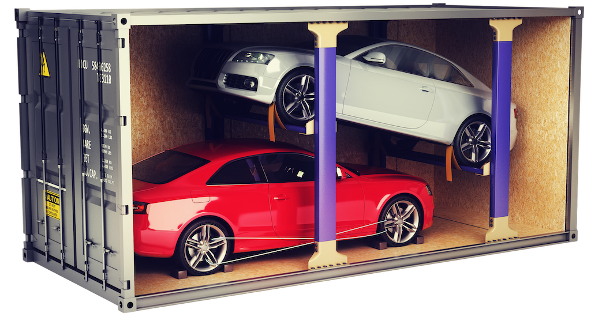

# CAR SHIPPING CONTAINER PROJECT

## TABLE OF CONTENT

Contents

1. INTRODUCTION
   - 1.1 Project Overview
   - 1.2 Project Deliverables
   - 1.3 Schedule and Budget Summaries
   - 1.4 Evolution of this document
   - 1.5 References
   - 1.6 Definitions, acronyms, and abbreviations
2. Project Organization
   - 2.1 Process model
   - 2.2 Organizational Structure
   - 2.3 Organizational boundaries and interfaces
   - 2.4 Project responsibilities
3. Managerial Process
   - 3.1 Management objectives and priorities
   - 3.2 Assumptions, dependencies, and constraint
   - 3.3 Risk management
   - 3.4 Monitoring and controlling mechanisms
4. Technical process.
    - 4.1 Methods, tools and techniques.
    - 4.2 Software documentation.
    - 4.3 Project support functions.

## 1. INTRODUCTION

### 1.1 Project Overview

The project described within this document is a Car  Shipping Container Application designed with the specific goal  to manage the shipment of the car containers loaded on the ships from origin ports, transit and destination ports.

The prospective end users will find this application more useful than traditional manual one currently in use because it will facilitate the ways the business and the customers will interact with each.

**The aim of this project is two fold.**

First, the preliminary requirements given by the client will be refined into a detailed requirements description which captures real customers' real needs/wants as precisely, concisely and conceptually as possible.

Secondly, a prototype will be developed which should demonstrate the key features of the detailed requirement in the real world.

This document gives a preliminary plan for how the company aims to achieve the above stated aims.

The first section gives an overview, describes project deliverables and itemizes the evolution of this document.

Lastly the first section gives the meaning of acronyms that may be encountered in the rest of document and lists references from which guidelines have been drawn. In the second section, the organizational structure of the executing team is given and the third section shows how the team as well as the project will be managed from inception to completion.

Technical Processes used are described in Section 4 while the fifth and final section details the work elements, schedule and budget for the project.

### 1.2 Project Deliverables

Phase Deliverables Due Date

| Date | Deliverable |
|---|---|
| Dec 12, 2023 | 1. Project plan |
| Jan 04, 2023 | 2. Client summary, business domain summary, questionnaire |
| Jan 13, 2023 | 3. Use cases, UML diagrams to model the existing system |
| Jan 18, 2023 | 4. User stories to express the requirements to solve the business problem Peer evaluations |
| Jan 27, 2023 | 5. Prototype user interface and client comments |
| Feb 03, 2023 | 6. Database design | pending |
| Feb 13, 2023 | 7. Implementation using MVC, client comments |

>1- Project Plan  (December 12, 2022)

- Car Container Project Plan
- Meeting to discuss the strategy of the project plan
- Each member assigned to search for clients
- System requirements Specifications
- Software requirements Specifications

> 2- Client summary (January 4, 2023)

- Client summary, business domain, summary, questionnaire
- Meeting to discuss the clients requirements
- Progress on deliverables
- Revised System requirements Specifications
- Revised Software requirements Specifications

> 3- Use cases, (Jan 13, 2023 )

- UML diagram to model the existing system
- Meeting to discuss the Use cases & UML diagram
- Revised the Use cases & UML diagram

> 4- User stories (January 18, 2023)

- Create user stories
- Meeting to discuss the user stories
- Revised system requirements specifications
- Revised software requirements specifications

> 5- Prototype User Interface for Testing(January 27, 2023)

- Present the prototype to the client
- Testing  and Test plans
- Meeting to discuss the feedback after presenting the prototype to the client
- Revised system requirements specifications
- Revised software requirements specifications

> 6- Database Design (February 3, 2023)

- Meeting to discuss  the database design after discussion with client
- Revised system requirements specifications
- Revised software requirements specifications

> 7- Implementation using MVC(February 13, 2023)

- Present the final prototype.
- Meeting to discuss the comments of the clients after implementation of the MVC.

### 1.3 Schedule and Budget Summaries

here is no budget given for this application. Therefore, this is the plan we decided for this project.

- The  first prototype will be delivered on Friday, January 27, 2023
- The final prototype will be delivered by Monday,  February  13, 2023.

### 1.4  Evolution of this document

This project management plan is a living document and as such will be subject to change as the term of the project moves forward.  Updates should be expected the following sections

- References  - updated as necessary
- Definitions, acronyms, and abbreviations - updated as necessary
- Organizational Structure will be updated as the team leaders are assigned for each phase.
- Technical Process - this section will be revised appropriately as the requirements and design decisions become clearer
- Schedule –as the project progresses, the schedule will be updated accordingly

### 1.5  References

<https://www.tutorialspoint.com/sdlc/sdlc_waterfall_model.htm>

### 1.6 Definitions, acronyms, and abbreviations

- UML: Unified Modeling Language -  A way to visually represent the architecture, design and implementation  of our project
- GUI:  Graphical User Interface – method  used to mediate between user and device through
- Visual representations and text.
- UI:  User Interface – the means by which a user and system interact
- Milestones:  end-point of a process activity
- Deliverables: project results delivered to customers

## 2. Project Organization

### 2.1  Process model

We will be using the Waterfall Model as it allows for the straightforward definition of progress milestones.

### 2.2 Organizational Structure

**Team members:**

- Iyad Aloudat - Developer & UI
- Siroos Rahimi - Developer & Data Base
- Mohammad Altamimi - Developer & UML
- Doris Chan - Developer & Copywriter

### 2.3 Organizational boundaries and interfaces

While certain persons will be delegated specific tasks, all the members shall function as both developers and testers throughout the development of the project.

### 2.4 Project responsibilities

For the responsibilities per phase of each team member per deliverable, please refer to Projet Deliverables 1.2 above. Finally, the whole project team is responsible for the successful  delivery of the project.

## 3 Managerial Process

### 3.1 Management objectives and priorities

Team leadership will main the responsibility of maintaining and containing the project schedule and ensuring that all work items are completed on schedule. Leadership  is also responsible for the creation of all deliverables and scheduling/running meetings.

### 3.2 Assumptions, dependencies, and constraint

Assumptions for this project are that, through the members of the team, have sufficient  knowledge in the areas of desktop application, Java Development, Sqlite Database, communications and project management is available.

In the project plan, a number of factors are taken into account:

- The team budget of 4 persons:  60 days
- The project deadline: February 13, 2023
- The final presentation: February 24, 2023

NOTE: Due to deadline of February 13, 2023, running out of time will have its reflection on the product, and not on the duration of the project.

By assigning a priority of every user requirement, a selection can be made of user requirements that may be dropped  out if time runs out.

### 3.3 Risk management

This section mentions any possible risks for the project. Also methods are defined to prevent or reduce these risks:

- Technological risks
- People risks
- Organizational risks
- Requirements risks
- Estimation risks

### 3.4 Monitoring and controlling mechanisms

The monitoring and controlling  of the  progress is done by the team using the following means:

- Weekly project status meetings
- Shared document repository
- Every member will adhere to the choice of specific tools and components throughout the project
- Setup milestones in advance of the final due date for each deliverable
- Reassign resources to fill the gap depending on the availability and previous knowledge of what the currently unavailable resource was working on.
- Client will be made aware, in advance, of the amount and type of change that can be accommodated within the term of the project.

## 4  Technical process

### 4.1 Methods, tools and techniques

All developers are required to use Eclipse and SQLite to minimize issues while developing.
UML diagrams will be generated by diagrams.net

### 4.2 Software documentation

The software users manual shall be generated along with the functional requirements and be validated during the acceptance process.

### 4.3 Project support functions

All project support documents will be completed in applicable phases.
