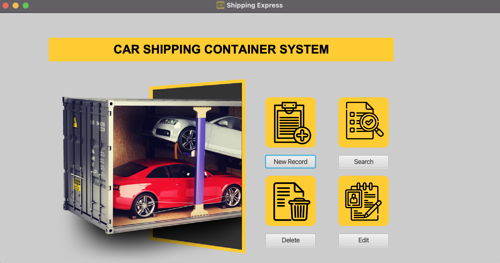

# 🌎 Vanier System Development Project

## Team Members: 
- Iyad Aloudat, 
- Mohammad Altamimi, 
- Siroos Rahimi, 
- Doris Chan

## Important Links: 
- 👉 * Team Log [+ Read more ...](Team-Log.md)
- 👉 0. App Source [+ Read more ...](0-AppSource/src/main/java/com/example/systemproject)
- 👉 1. Project plan [+ Read more ...](1-Project-Plan)
- 👉 2. Client Summary, Questionnaire  [+ Read more ...](2-Client-Summary)
- 👉 3. Use Cases UML [+ Read more ...](3-Use-Cases-UML)
- 👉 4. User Stories [+ Read more ...](4-User-Stories)
- 👉 5. Prototype UI[+ Read more ...](5-PrototypeUI)
- 👉 6. Database Design [+ Read more ...](6-Database-Design)
- 👉 7. MVC  [+ Read more ...](0-AppSource)

## Schedule
| Date | Deliverable | Status
|---|---|---|
| Mon, Dec 12 | 1. Project plan | Done |
| Wed, Jan 04 | 2. Client summary, business domain summary, questionnaire | Done  |
| Mon, Jan 23 | 3. Use cases, UML diagrams to model the existing system | Done |
| Wed, Feb 01 | 4. User stories to express the requirements to solve the business problem Peer evaluations | Done |
| Wed, Feb 01 | 5. Prototype user interface and client comments | Done |
| Wed, Feb 08 | 6. Database design | Done |
| Thu, Feb 16 | 7. Implementation using MVC, client comments | Done |
| Fri, Feb 24 | 8. Finale | Done |
